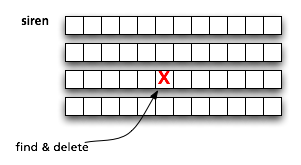

# Introducing FlockDB

Twitter's social graph is the network of relationships between people: who you're following, who's
following you, who you receive phone notifications from, and so on.

Early on, we decided to store these connections a little differently. Instead of requiring a siren
to confirm her friendship with Odysseus, we let Odysseus follow the siren in a "one-way"
relationship. There's also no limit to how many people are allowed to follow you, so one user can
have millions of followers. Unfortunately, these decisions also made it difficult to scale as we
grew.

## A valiant effort

To deliver a tweet, we need to be able to look up someone's followers and page through them rapidly.
But we also need to handle heavy write traffic, as followers are added or removed, or spammers are
caught and put on ice. And for some operations, like delivering a mention, we need to do set
arithmetic like "who's following both of these users?"

For a while, we managed to store these relationships in "denormalized lists". A simple key-value
store held the follower lists in chunks which could be read sequentially, chunk by chunk -- ideal
for delivering tweets. New followers were just added to the end. Unfollowing was very intensive,
though. The entire follower list had to be scanned, and when the right chunk was found, it had to be
rewritten in whole. Disk I/O was going through the roof.

A little over a year ago, we could see that this wasn't going to work much longer, and decided to write a replacement. Our goals were:

- Write the simplest possible thing that could work.

- Use off-the-shelf MySQL as the storage engine, because we understand its behavior. Give it enough
  memory to keep everything in cache.

- Allow for horizontal sharding with a lookup table.

- Allow modification requests to arrive out of order or be processed more than once. (Allow failures
  to result in redundant work rather than lost work.)

FlockDB was the result. We've been using it exclusively for about 6 months now.

## A valiant-er effort

FlockDB stores graphs as sets of edges between nodes identified by 64-bit integers. For a social
graph, these node IDs will be user IDs, but in a graph storing "favorite" tweets, the destination
may be a tweet ID. Each edge is also marked with a 32-bit position, used for sorting. (Twitter puts
a timestamp here for the "following" graph, so that your follower list is displayed latest-first.)

It isn't meant to be a "graph database" in the sense that it optimizes for graph-walking queries,
only in the sense that it stores graph data. It instead optimizes for very large data sets, fast
reads and writes, and page-able set arithmetic queries. We currently store over 13 billion edges and
sustain peak traffic of 20k writes/second and 100k reads/second.

The app servers (affectionately called "flapps") are written in scala and are interchangable
commodities. We can add more as query load increases, independent of the databases. They expose a
very small thrift API to clients, though we've written
[a ruby client](http://github.com/twitter/flockdb-client)
with a much richer interface.

We use [gizzard](http://github.com/twitter/gizzard) to handle the sharding layer, so a forwarding
table maps ranges of source IDs to physical databases, and replication is handled by building a tree
of such tables under the same forwarding address. Write operations are acknowledged after being
journalled locally, so that minor database problems are decoupled from website response times.

Some helpful patterns fell out of our experience, even though they weren't goals originally:

- Make every case an error case. Or, to put it another way, use the same code path for errors as you
  use in normal operation. Don't create rarely-tested modules that only kick in during emergencies,
  when you're least likely to feel like trying new things.

- Do nothing automatically at first. Provide lots of gauges and levers, and automate with scripts
  once patterns emerge.

## Check it out

The source is in github: [http://github.com/twitter/flockdb](http://github.com/twitter/flockdb)

In particular, check out the demo to get a feel for the kind of data that can be stored and what you
can do with it:
[http://github.com/twitter/flockdb/blob/master/doc/demo.markdown](http://github.com/twitter/flockdb/blob/master/doc/demo.markdown)

Talk to us on IRC, in #twinfra (irc.freenode.net), or join the mailing list:
[http://groups.google.com/group/flockdb](http://groups.google.com/group/flockdb)
