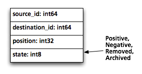
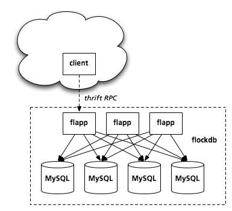

# Introducing FlockDB

Twitter stores many graphs of relationships between people: who you're following, who's following
you, who you receive phone notifications from, and so on.

Some of the features of these graphs have been challenging to store in scalable ways as we've grown.
For example, instead of requiring each friendship to be requested and confirmed, you can build
one-way relationships by just following other people. There's also no limit to how many people are
allowed to follow you, so some people have millions of followers (like @aplusk), while others have
only a few.

To deliver a tweet, we need to be able to look up someone's followers and page through them rapidly.
But we also need to handle heavy write traffic, as followers are added or removed, or spammers are
caught and put on ice. And for some operations, like delivering a @mention, we need to do set
arithmetic like "who's following both of these users?" These features are difficult to implement in a traditional relational database.

## A valiant effort

We went through several storage layers in the early days, including abusive use of relational tables
and key-value storage of denormalized lists. They were either good at handling write operations or
good at paging through giant result sets, but never good at both.

A little over a year ago, we could see that we needed to try something new. Our goals were:

- Write the simplest possible thing that could work.

- Use off-the-shelf MySQL as the storage engine, because we understand its behavior -- in normal use
  as well as under extreme load and unusual failure conditions. Give it enough memory to keep
  everything in cache.

- Allow for horizontal partitioning so we can add more database hardware as the corpus grows.

- Allow write operations to arrive out of order or be processed more than once. (Allow failures to
  result in redundant work rather than lost work.)

FlockDB was the result. We finished migrating to it about 9 months ago and never looked back.

## A valiant-er effort

FlockDB is a database that stores graph data, but it isn't a database optimized for graph-traversal
operations. Instead, it's optimized for very large [adjacency
lists](http://en.wikipedia.org/wiki/Adjacency_list), fast reads and writes, and page-able set
arithmetic queries.

It stores graphs as sets of edges between nodes identified by 64-bit integers. For a social graph,
these node IDs will be user IDs, but in a graph storing "favorite" tweets, the destination may be a
tweet ID. Each edge is also marked with a 64-bit position, used for sorting. (Twitter puts a
timestamp here for the "following" graph, so that your follower list is displayed latest-first.)

When an edge is "deleted", the row isn't actually deleted from MySQL; it's just marked as being in
the deleted state, which has the effect of moving the primary key (a compound key of the source ID,
state, and position). Similarly, users who delete their account can have their edges put into an
archived state, allowing them to be restored later. We keep only a compound primary key and a
secondary index for each row, and answer all queries from a single index. This kind of schema
optimization allows MySQL to shine and gives us predictable performance.

A complex query like "What's the intersection of people I follow and people who are following
President Obama?" can be answered quickly by decomposing it into single-user queries ("Who is
following President Obama?"). Data is partitioned by node, so these queries can each be answered by
a single partition, using an indexed range query. Similarly, paging through long result sets is done
by using the position field as a cursor, rather than using `LIMIT/OFFSET`, so any page of results
for a query is indexed and is equally fast.

Write operations are [idempotent](http://en.wikipedia.org/wiki/Idempotence) and
[commutative](http://en.wikipedia.org/wiki/Commutative), based on the time they enter the system. We
can process operations out of order and end up with the same result, so we can paper over temporary
network and hardware failures, or even replay lost data from minutes or hours ago. This was
especially helpful during the initial roll-out.

Commutative writes also simplify the process of bringing up new partitions. A new partition can
receive write traffic immediately, and receive a dump of data from the old partitions slowly in the
background. Once the dump is over, the partition is immediately "live" and ready to receive reads.

The app servers (affectionately called "flapps") are written in Scala, are stateless, and are
horizontally scalable. We can add more as query load increases, independent of the databases. They
expose a very small thrift API to clients, though we've written [a Ruby
client](http://github.com/twitter/flockdb-client) with a much richer interface.

We use [the Gizzard library](http://github.com/twitter/gizzard) to handle the partitioning layer. A
forwarding layer maps ranges of source IDs to physical databases, and replication is handled by
building a tree of such tables under the same forwarding address. Write operations are acknowledged
after being journalled locally, so that disruptions in database availability or performance are
decoupled from website response times.

Each edge is actually stored twice: once in the "forward" direction (indexed and partitioned by the
source ID) and once in the "backward" direction (indexed and partitioned by the destination ID).
That way a query like "Who follows me?" is just as efficient as "Who do I follow?", and the answer
to each query can be found entirely on a single partition.

The end result is a cluster of commodity servers that we can expand as needed. Over the winter, we
added 50% database capacity without anyone noticing. We currently store over **13 billion edges**
and sustain peak traffic of **20k writes/second** and **100k reads/second**.

## Lessons learned

Some helpful patterns fell out of our experience, even though they weren't goals originally:

- **Use aggressive timeouts to cut off the long tail.**

  You can't ever shake out all the unfairness in the system, so some requests will take an
  unreasonably long time to finish -- way over the 99.9th percentile. If there are multiple
  stateless app servers, you can just cut a client loose when it has passed a "reasonable" amount of
  time, and let it try its luck with a different app server.

- **Make every case an error case.**

  Or, to put it another way, use the same code path for errors as you use in normal operation. Don't
  create rarely-tested modules that only kick in during emergencies, when you're least likely to
  feel like trying new things.

  We queue all write operations locally (using [Kestrel](http://github.com/robey/kestrel) as a
  library), and any that fail are thrown into a separate error queue. This error queue is
  periodically flushed back into the write queue, so that retries use the same code path as the
  initial attempt.

- **Do nothing automatically at first.**

  Provide lots of gauges and levers, and automate with scripts once patterns emerge. FlockDB
  measures the latency distribution of each query type across each service (MySQL, Kestrel, Thrift)
  so we can tune timeouts, and reports counts of each operation so we can see when a client library
  suddenly doubles its query load (or we need to add more hardware).

  Write operations that cycle through the error queue too many times are dumped into a log for
  manual inspection. If it turns out to be a bug, we can fix it, and re-inject the job. If it's a
  client error, we have a good bug report.

## Check it out

The source is in github: [http://github.com/twitter/flockdb](http://github.com/twitter/flockdb)

In particular, check out the demo to get a feel for the kind of data that can be stored and what you
can do with it:
[http://github.com/twitter/flockdb/blob/master/doc/demo.markdown](http://github.com/twitter/flockdb/blob/master/doc/demo.markdown)

Talk to us on IRC, in #twinfra (irc.freenode.net), or join the mailing list:
[http://groups.google.com/group/flockdb](http://groups.google.com/group/flockdb)
